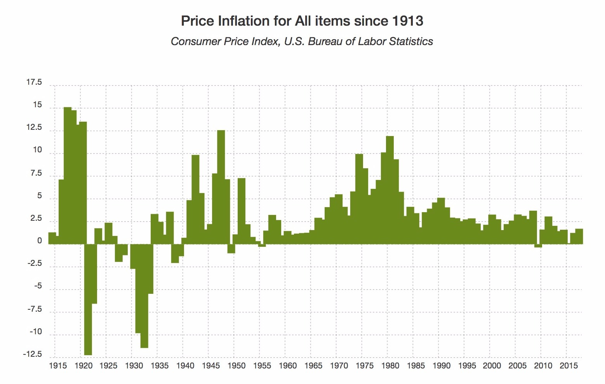
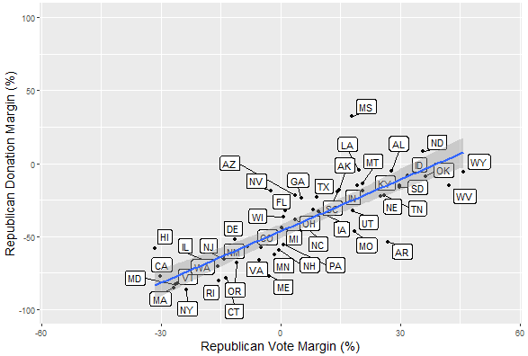

```{r setup, include=FALSE}
knitr::opts_chunk$set(echo = TRUE, fig.align="center")
library(tidyverse)
library(shiny)
library(ggrepel)
library(here)
library(shinythemes)
library(datasets)
library(mdsr)
library(gapminder)
library(maps)
library(dplyr)
library(ggplot2)
```

# Introduction

The 2020 election was the most expensive in American history: Campaign spending on the presidential election and congressional races totaled a staggering 14 billion dollars, shattering the previous record of 7 billion dollars. The increasingly important role that money plays in American politics suggests some natural questions: Where does this money come from? What's driving the explosion in fundraising? How are fundraising totals by each party associated with election results?

## Identifying Donations to Candidates

To better understand how individual donations to candidates have changed over time, we use data from the Federal Election Commission, henceforth abbreviated FEC. These data go back several decades and allow us to readily identify shifts in donations over the past 20 years. Fortunately, the FEC website contains a treasure trove of detailed information, outlining how much money each candidate raised from each state, as well as how much they raised from five different donation amounts: donations under \$200, between \$200 and \$500, between \$500 and \$1000, between \$1000 and \$2000, and over \$2000. Below we present a snippet of this dataset:

```{r pretty, echo = FALSE, warning=FALSE, message=FALSE}

#Vector used to transform nominal values into 2020 dollars.
v <- c(1.5, 1.36, 1.18, 1.12, 1.07, 1)

campaignDonations <- read_csv(here("data", "CampaignFinanceDataOriginal.csv")) %>%
  mutate(total= under200 + between200and500 + between500and1000 + between1000and2000+ morethan2000) %>%
  mutate(real_total = total * v[(year - 1996)/4]) %>%
  mutate(party = case_when(
    candidate == "Joe Biden" ~ "D",
    candidate == "Donald Trump" ~ "R",
    candidate == "Hillary Clinton" ~ "D",
    candidate == "Barack Obama" ~ "D",
    candidate == "Mitt Romney" ~ "R",
    candidate == "John McCain" ~ "R",
    candidate == "George Bush" ~ "R",
    candidate == "John Kerry" ~ "D",
    candidate == "Al Gore" ~ "D"
  ))

write.csv(campaignDonations, "data/campaignDonations.csv")

totalDonations <- campaignDonations %>%
  group_by(year) %>%
  summarize(
    under200 = sum(under200),
    between200and500 = sum(between200and500),
    between500and1000 = sum(between500and1000),
    between1000and2000 = sum(between1000and2000),
    morethan2000 = sum(morethan2000),
    total = sum(total),
    real_total = sum(real_total)
  ) %>%
  pivot_longer(
    cols = c(under200, between200and500, between500and1000, between1000and2000, morethan2000),
    names_to = "type",
    values_to = "amount")

```
```{r}
head(totalDonations)
```
# Donors by Party Over Time
Our first question of interest was changing patterns in campaign donations. Specifically, do individual donors give more money to Democratic presidential candidates or Republican presidential candidates? The following chart shows inflation-adjusted data from the past 20 years.

```{r, echo = FALSE}

ggplot(data = campaignDonations, aes(x = year, y = real_total/1000000)) +
  geom_line(aes(color = party)) +
  scale_color_manual(name = "Party", breaks = c("D", "R"), labels = c("Democrat", "Republican"), 
                     values = c("blue", "darkred")) +
  scale_x_continuous(breaks = seq(2000, 2020, by = 4)) +
  scale_y_continuous(breaks = seq(0, 1200, by = 100)) +
  xlab("Year") +
  ylab("Total Individual Contributions (Millions of Dollars)") +
  ggtitle("Total Individual Contributions by Party")

```

The diagram reveals a clear trend: While George Bush outraised his Democratic rivals in 2000 and 2004, the Democratic presidential candidate has enjoyed a large and growing fundraising advantage in every election since. While both parties have increased their fundraising levels from individual contributions, the trend has been driven primarily by increased donations to Democrats. One caveat applies, however: This is limited to individual contributions and does not include the fundraising of large Political Action Committees (PACs) that support or oppose particular candidates. PACs face far more lenient regulations -- some don't have to disclose the source of donations, and so-called super PACs can take unlimited money from corporations and labor unions -- so they have a large impact in elections. But perhaps the Democrats' large advantage in individual contributions is one reason why they want to limit the influence of PACs and why Republicans are more supportive of them.

# Comparison of Large and Small Donors

In addition to looking at donations by party, we want to look at the total raised from each of the FEC's five donation amounts in each election. Has the increase in fundraising been driven by more large donations? More small donations? Donations in between? The following chart gives a clear answer.

```{r, echo = FALSE}

ggplot(data = totalDonations, aes(x = year, y = amount/1000000)) +
  geom_line(aes(color = type)) +
  scale_color_discrete(name = "Donation Type", 
                       breaks = c("under200", "between200and500", "between500and1000", 
                                  "between1000and2000", "morethan2000"), 
                       labels = c("Under $200", "Between $200 and $500", 
                                  "Between $500 and $1000", "Between $1000 and $2000",
                                  "More than $2000")) +
  scale_x_continuous(breaks = seq(2000, 2020, by = 4)) +
  scale_y_continuous(breaks = seq(0, 1000, by = 100)) +
  xlab("Year") +
  ylab("Total Contributed (Millions of Dollars)") +
  ggtitle("Individual Contributions by Donation Type")

```

While donations between \$200 and \$2000 have increased slightly since 2000, large donations above \$2000 have seen a much sharper increase. But by far the largest increase -- one that dwarfs all the others -- has been the rise of small donations under $200. This suggests that more people have been donating money (if the same number were donating more money, we would probably see a sharper rise in larger donation amounts).

## Limitations

Again, though, a few limitations complicate matters. Someone could theoretically donate multiple $200 checks, which would all fall in the "under \$200" category, when they really amount to larger donation. To correct for this, we would have to look at individual-level data. The FEC actually has datasets that show every single donation to each candidate, but these datasets are so large and so unwieldy that we didn't have the heart to use them. Additionally, we think that if someone wants to donate, say, \$1000, they would do so directly instead of writing five \$200 checks. Some people might have made multiple donations equal to one larger donation in a different bracket, but we think they represent a distinct minority of donors.

## Inflation

Inflation presents another problem. A \$900 donation in 2000 is the equivalent of about a \$1300 donation today. But the FEC classifies it in the "between \$500 and \$1000" category since the nominal value of the donation is \$900. As a result, simply adjusting the the total donations between \$500 and \$1000 in 2000 for inflation doesn't allow for an accurate comparison to that same number for the 2020 election. Some donations from 2000 that belong in a higher category (in 2020 dollars) would be counted in the lower donation bracket. We could adjust the FEC's five donation categories for inflation as well, so "donations under \$200" in 2000 would become "donations under \$300" in 2020 dollars (as the price level has risen about 50% in that time). But we still wouldn't get the desired comparison: donations in the 2000 election under \$200 in 2020 dollars versus donations in the 2020 election under \$200 in 2020 dollars. Once again, we could get around this with individual-level data, as we could adjust each individual donation for inflation and then compute the total for each donation bracket. Had we but world enough and time...

Given these issues, we've decided to leave the values in the chart in nominal terms (not adjusting for inflation). This is unfortunate, but there is one redeeming quality: Inflation has been quite low over the past 20 years, especially since the Great Recession. A dollar in 2008 is worth only \$1.18 today, so inflation alone cannot explain the dramatic increases in campaign donations.



## Fundraising Audience and Donation Trends

We speculate that the internet has made fundraising much easier and allowed candidates to reach a much larger pool of donors than they ever could before. Anyone with an internet connection can donate to a candidate in a manner of minutes: They need only go to the candidate's website, click one of the many bright buttons asking for financial support, and enter their payment details. At the same time, one could argue that the internet has heightened political polarization, causing more voters to donate to campaigns. But since our goal is statistical analysis and not amateur political punditry, we defer this idea to future researchers.

Having examined donation trends by party and donation level, we next combine both frameworks. In our Shiny app, the user can compare how much money selected candidates raised from specified donation categories. The same inflation issues apply, so we've left everything in nominal terms, but some interesting comparisons are still possible. For example, in 2012 Mitt Romney raised more money than Barack Obama from donations over \$2000. The 2016 election, however, saw a sharp reversal: Hillary Clinton raised more than Donald Trump from donations over \$2000. We invite you compare other candidates as well using the link below:

https://slawton21.shinyapps.io/Blog-Seamus-Matthew/

# Donations and Electoral Margin of Victory

The next question we wanted to address was how donations to each party in individual states are correlated to the margin of victory for those parties. Somewhat unsurprisingly, side-by-side maps reveal that Republicans tend to outperform Democrats in states where they raise more money than democrats. Here is the most recent example from the 2020 election.


However, there were some striking outliers in this dataset. In particular, in the 2016 election, it appears that Donald Trump had a substantial fundraising problem. This was likely the result of many moderate Republicans concerned with Trump as a result of his unusual populist messaging. As seen below, Trump had an unprecedented fundraising deficit when compared to the Clinton campaign, even in states where he was assumed to be strongly favored. Given this fundraising gap, it is somewhat easy to see why Clinton was so strongly favored at the time.


However, looking closely at the relationship between fundraising and margin of victory, we can see that even in 2016, there was a very strong correlation between the Republican share of donations in each state and the margin of victory in that state. This indicates that voter reluctance to donate to Trump relative to his actual support at the ballot box was fairly uniform across the country.



## Implications for Election Forecasting

While donations can be a strong indicator of voter enthusiasm, one must use caution when using fundraising hauls to predict candidate success in individual states. In the best cases, such as the 2020 election, the winner of the funraising fight is closely tied to the eventual winner in the state, but in the worst cases, such as the 2016 election, fundraising margins can subvert expectations and mislead election forecasters. Based on these results, we think it is wise to incorporate three factors when attempting to predict voting behavior from fundraising: 1) Compare statewide fundraising hauls between the two parties in both the current election cycle and previous election cycles 2) Correct for nationwide shifts in donation totals. 3) Incorporate National Polling

If we look at the diagram below, it is clear that Idaho, New York, and South Carolina have stayed consistent in voting preferences over many years, while the amount donated in support of either party has varied wildly in these same states (e.g. 2016 vs. 2020). Importantly however, despite the major differences between these states, the year to year changes in donation totals are well correlated even though election margins changed very little. In combination with demographic analyses and national polls to adjust for actual changes in voter sentiment, correcting for nationwide donation shifts should be possible, allowing us to predict statewide results independently of statewide polls which were notoriously inaccurate across the past two election cycles.


## Further Exploration

We have developed a shiny application which allows the user to explore various trends in donations and margins of victory across several elections and in specific states beyond what is displayed in the figures above. It conveniently contains all the code necessary to generate the figures shown above.

https://mattperk.shinyapps.io/Margins/

# Future Directions

Based on these observations, it is clear that fundraising totals can be somewhat predictive of election results, but only if analyzed very cautiously. In the future, we plan to build a model which takes into account fundraising and national polling to predict state to state results. Fortunately, this is extremely easy to backtest, and it would be very interesting to see if a model can be made that can consistently outperform statewide polling. While such a model is probably unlikely to perform that well by itself, it would be a useful piece of a more robust model taking into account additional parameters.

Additionally, combining this methodology with our analysis of large and small donations in each state may help provide even greater insight into how candidates will perform. We expect that smaller donations will continue to rise as everyday individuals and young people become more engaged in politics, especially among democrats, but we do not yet know how this is likely to influence election outcomes. Future work will help to answer the question of how specific types of donations are correlated with candidate success across different states.

# Sources

### Data
https://fec.gov/data/elections/president/#### (where #### is the presidential election year)
https://dataverse.harvard.edu/dataset.xhtml?persistentId=doi:10.7910/DVN/42MVDX

### Inflation Diagram
https://www.in2013dollars.com/current-inflation-rate

